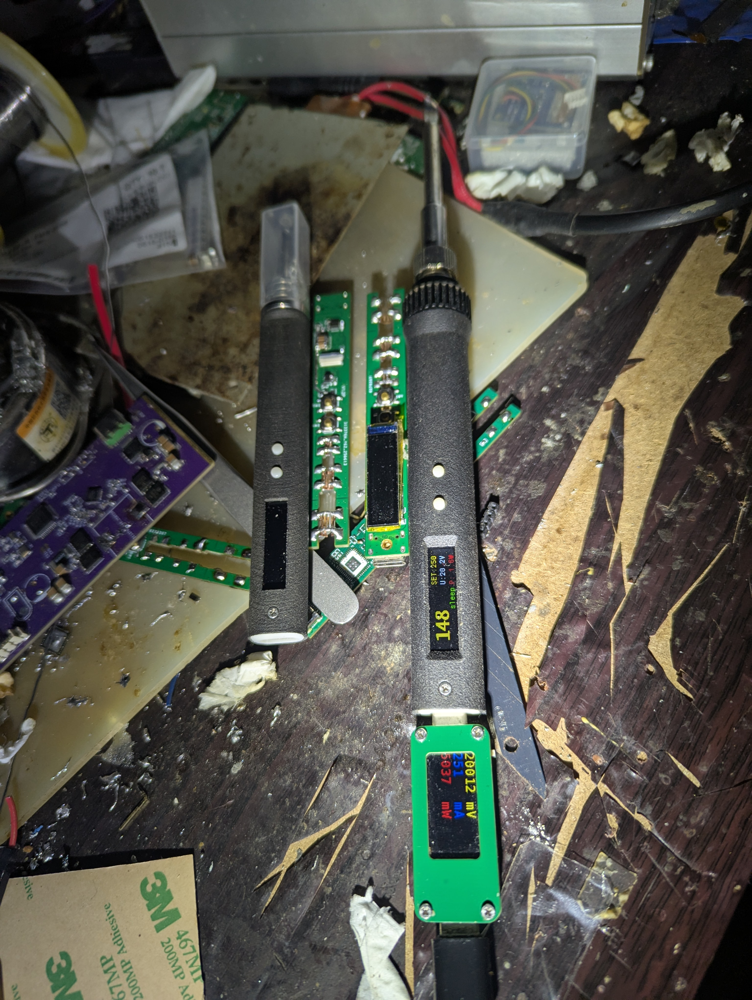
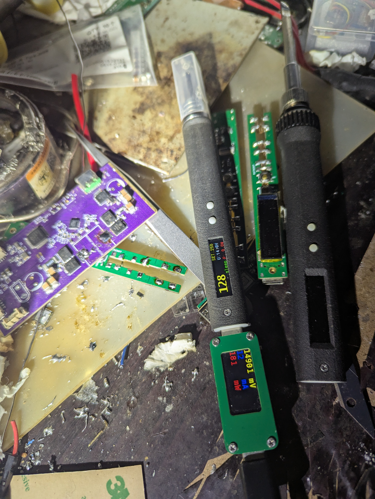

## 如何制作

这个项目从硬件焊接到固件刷机，还算容易上手。但需要一些电子和3D打印基础。整个过程分硬件、3D外壳和固件三步。**注意**：全程避免短路，测试时用万用表检查。
## 做好的实物

### 1. 准备材料和工具
- **核心电子部件**（详见hardware硬件）：
  - STM32G431CBU6（主控）,现在这个芯片价格贵，因为之前囤了几片所以就没改主控。
  - TPS62933降压（提供3.3V电源）。
  - MCP1415驱动器（C210推荐版，用于高频驱动减少噪音；电阻分压版可选但有噪音）。
  - 姿态传感器（用于自动检测闲置休眠）。
  - 电阻、电容、按键小板等外围。
  - 加热芯：T12或C210（推荐C210新版，兼容性好）。
- **3D打印材料**：建议尼龙，耐高温一些。
- **工具**：
  - 烙铁（用现有的焊这个项目）。
  - 3D打印机（或在线打印服务）。
  - STM32CubeProgrammer软件（刷机用）。
  - ST-Link调试器（可选，但推荐用于调试）。
  - USB Type-C线和转接板（用于SBU1/SBU2引出）。
  - 万用表（测试电压）。
  - OpenSCAD软件（自定义外壳）。

### 2. 硬件PCB焊接
PCB文件在hardware目录，用立创EDA打开或直接用开源链接导入。T12版需主板+按键小板；C210推荐MCP1415驱动版（PWM频率20kHz，无噪音）。

**焊接步骤**（顺序重要，避免损坏）：
1. **先焊Type-C接口**：先焊接好接口方便下面测试电源。
1. **焊TPS62933**：上电测试输出是否稳定在3.3V（用万用表测）。如果全焊接可能电源有问题搞坏单片机，血泪教训。
2. **焊STM32微控制器和姿态传感器**：确保引脚对齐，无虚焊。姿态传感器方向按丝印。
3. **焊外围部件**：电阻、电容、按键小板
4. **测试**：上电检查无短路，姿态传感器是否响应（摇晃时有反应）。如果用C210电阻版，加热时可能有嗡嗡噪音——切换MCP1415版解决。

**常见问题**：如果加热不稳，检查驱动电路；T12版按键小板需对齐主板接口。

### 4. 屏幕
屏幕使用的0.99英寸的tft屏幕,驱动为GC9D01,分辨率40x160,10PIN插接. 可以从某宝上购买

### 3. 3D打印外壳
源文件在scad，用OpenSCAD打开。模型参数化，可自定义（如调整C210头尺寸，按文件注释修改）。

**打印步骤**：
1. 打开.scad文件，修改或者增加一些自定义的东西，生成STL。
2. 打印两部分：外壳主体 + 按键模块&顶部盖（一体打印）。
4. 组装：将PCB塞入主体，按键盖扣上。确保加热芯插入顺畅，无松动。

**提示**：如果没打印机，导出STL后找服务打印。

### 4. 螺丝与螺母
1. 3D打印的顶部盖子需要在孔内热熔一个M1.6高度为2mm的螺母。
2. PCB按键背部焊接一个M1.6高度为4mm的螺母。
3. 螺丝使用M1.6长度为3mm的扁平头螺丝（T12可能需要更长的，但是背部其实不上这个螺丝也影响不大）。
4. 这些可以通过某宝购买，螺母搜索“土八热熔螺母 滚花”这些就行，螺丝搜索M1.6螺丝。

### 3. 一些注意事项
C245使用PD20V供电,那么mcp1415得使用国产替代(MCP1415T-E/OT-JSM)它们最大电压为25V.
同时功率PMOS的Vgs也需要最大25V. 因为mcp1415是低边NMOS驱动有UVLO功能,把它用来驱动
高边PMOS在上电时就有个问题,有的充电器可能电压上升慢导致UVLO触发,拉低了PMOS的G极让
烙铁头导通从而协议请求失败.

### 5. 刷机与固件
固件在firmware。**刷机前必须移除烙铁头**（防止一些引脚电平不确定可能导致加热）！

**DFU模式刷机**：
1. 按住K2键，插入USB Type-C线进入DFU模式。
2. 用STM32CubeProgrammer连接设备，导入固件文件，点击“Download”刷入。
3. 测试：上电检查加热功能和姿态响应（闲置几分钟应自动休眠）。

**ST-Link调试（推荐高级用户）**：
1. 用转接板引出Type-C的SBU1/SBU2（类似T12按键板的适配器）。
2. 连接ST-Link到电脑和设备C口。
3. 在STM32CubeProgrammer选ST-Link模式，刷机/调试固件。

**常见问题**：DFU不识别？检查USB驱动。固件不工作？验证commit版本，重新编译如果自定义。

如果卡在某步，欢迎在Issues讨论。

